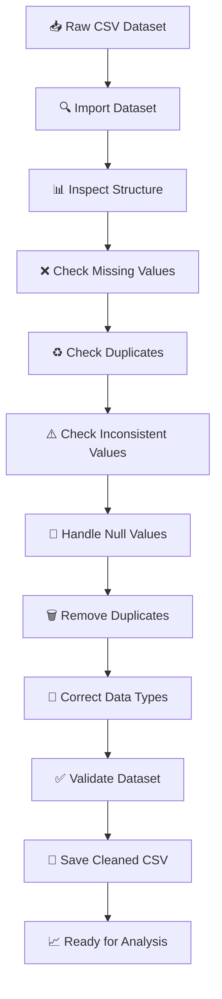

# 🍽️ Restaurant Sales Data — Cleaning & Preprocessing

<p align="center">

  
  
  
  
  

</p>

<p align="center">
  <b>🚀 Data Cleaning • Data Preprocessing • Data Quality • Pandas</b>
</p>

---

## 📌 Table of Contents

- [📖 Project Overview](#-project-overview)
- [🎯 Objectives](#-objectives)
- [🗂️ Project Structure](#️-project-structure)
- [📊 Dataset](#-dataset)
- [🛠️ Technologies](#️-technologies-used)
- [🔄 Data Cleaning Workflow](#-data-cleaning-workflow)
- [🔍 Data Inspection](#-data-inspection)
- [🧹 Data Cleaning](#-data-cleaning-process)
- [💾 Output](#-output)
- [📸 Project Screenshots](#-project-screenshots)
- [💡 Key Learnings](#-key-learnings)
- [🚀 Future Scope](#-future-scope)
- [👨‍💻 Author](#-author)

---

## 📖 Project Overview

This project is part of the **CODSOFT Data Analytics Internship — Task 1**.

The objective of this task is to perform complete **data cleaning and preprocessing** on a restaurant sales dataset using **Python, Pandas, and NumPy**.

The project focuses on identifying and resolving common data quality problems such as:

- Missing values
- Duplicate records
- Inconsistent categorical values
- Incorrect data types
- Unnecessary spaces
- Data quality issues

After cleaning, the processed dataset is saved as a new CSV file and prepared for further data analysis.

---

## 🎯 Objectives

The major objectives of this project are:

| # | Objective |
|---|---|
| 01 | 📥 Import the dataset using Python |
| 02 | 🔎 Inspect dataset structure |
| 03 | ❌ Identify missing values |
| 04 | ♻️ Detect duplicate records |
| 05 | ⚠️ Identify inconsistent data entries |
| 06 | 🧹 Handle null values |
| 07 | 🗑️ Remove duplicate records |
| 08 | 🔄 Correct data types |
| 09 | ✅ Validate cleaned data |
| 10 | 💾 Save cleaned dataset |

---

## 🗂️ Project Structure

```text
Codsoft-Internship/
│
├── Task-1/
│   │
│   ├── data/
│   │   ├── raw/
│   │   │   └── restaurant_sales_data.csv
│   │   │
│   │   └── processed/
│   │       └── restaurant_sales_data_cleaned.csv
│   │
│   ├── notebooks/
│   │   └── restaurant_sales_data_cleaning.ipynb
│   │
│   └── README.md
│
└── ...
```

### 📁 Folder Description

- `data/raw/` → Original dataset
- `data/processed/` → Cleaned dataset
- `notebooks/` → Jupyter Notebook containing the complete analysis
- `README.md` → Project documentation

---

## 📊 Dataset

The project uses a **Restaurant Sales Dataset** containing sales-related information.

### Example Columns

| Column | Description |
|---|---|
| `Order ID` | Unique order identifier |
| `Customer ID` | Customer identifier |
| `Category` | Food category |
| `Item` | Ordered item |
| `Price` | Price of item |
| `Quantity` | Quantity ordered |
| `Payment Method` | Payment method |
| `Order Date` | Date of order |

### 📐 Dataset Size

```text
Rows    : 17,534
Columns : 9
```

---

## 🛠️ Technologies Used

<p align="center">


</p>

---

# 🔄 Data Cleaning Workflow



---

# 🔍 Data Inspection

The dataset was first imported using Pandas.

```python
import pandas as pd
import numpy as np

data = pd.read_csv("../data/raw/restaurant_sales_data.csv")
```

### Dataset Shape

```python
print("Dataset Shape:", data.shape)
```

### Dataset Information

```python
data.info()
```

### First Five Rows

```python
display(data.head())
```

These steps help understand:

- Number of rows
- Number of columns
- Column names
- Data types
- Existing values

---

# 🧹 Data Cleaning Process

## 1️⃣ Missing Values

Missing values were identified using:

```python
data.isnull().sum()
```

The missing values were then handled based on the data type and column characteristics.

### Numerical Columns

```python
numeric_columns = data.select_dtypes(include=np.number).columns

for column in numeric_columns:
    data[column] = data[column].fillna(
        data[column].median()
    )
```

### Categorical Columns

```python
categorical_columns = data.select_dtypes(
    include="object"
).columns

for column in categorical_columns:
    if data[column].isnull().any():
        data[column] = data[column].fillna(
            data[column].mode()[0]
        )
```

---

## 2️⃣ Duplicate Records

Duplicate records were detected using:

```python
duplicate_count = data.duplicated().sum()

print(
    "Number of duplicate records:",
    duplicate_count
)
```

Duplicate rows were removed using:

```python
data = data.drop_duplicates()
```

---

## 3️⃣ Inconsistent Data Entries

Categorical columns were inspected using:

```python
print(data["Category"].value_counts(dropna=False))

print(data["Item"].value_counts(dropna=False))

print(data["Payment Method"].value_counts(dropna=False))
```

This helped identify:

- Unexpected values
- Missing categories
- Extra spaces
- Different spellings
- Inconsistent entries

---

## 4️⃣ Remove Extra Spaces

Text columns were standardized using:

```python
text_columns = data.select_dtypes(
    include="object"
).columns

for column in text_columns:
    data[column] = data[column].str.strip()
```

---

## 5️⃣ Correct Data Types

Numerical columns were converted using:

```python
data["Price"] = pd.to_numeric(
    data["Price"],
    errors="coerce"
)

data["Quantity"] = pd.to_numeric(
    data["Quantity"],
    errors="coerce"
)
```

Date columns were converted using:

```python
data["Order Date"] = pd.to_datetime(
    data["Order Date"],
    errors="coerce"
)
```

Correct data types make the dataset more reliable for future analysis.

---

# ✅ Data Validation

After cleaning, the dataset was checked again.

```python
print("Final Dataset Shape:", data.shape)

print("\nMissing Values:")
print(data.isnull().sum())

print("\nDuplicate Records:")
print(data.duplicated().sum())

print("\nData Types:")
print(data.dtypes)
```

### Validation Checklist

- [x] Missing values checked
- [x] Duplicate records checked
- [x] Duplicate records removed
- [x] Inconsistent values inspected
- [x] Text values standardized
- [x] Data types corrected
- [x] Final dataset validated

---

# 💾 Output

The cleaned dataset was exported as a new CSV file.

```python
output_path = "../data/processed/restaurant_sales_data_cleaned.csv"

data.to_csv(
    output_path,
    index=False
)

print("Cleaned dataset saved successfully!")
```

### 📁 Generated File

```text
data/processed/
└── restaurant_sales_data_cleaned.csv
```

---

# 📓 Jupyter Notebook

The complete data cleaning process is available in the Jupyter Notebook.

### ▶️ Run the Project

1. Clone the repository.
2. Open the `Task-1` folder.
3. Open Jupyter Notebook/JupyterLab.
4. Open:

```text
notebooks/restaurant_sales_data_cleaning.ipynb
```

5. Run the cells from top to bottom.

---

# 📸 Project Screenshots

## 🔎 Dataset Inspection


```text
Task-1/
└── screenshots/
    ├── dataset_preview.png
    ├── missing_values.png
    ├── duplicate_check.png
    └── cleaned_dataset.png
```

Then use:

```markdown

```

### Dataset Preview


---

## ❌ Missing Values Analysis
